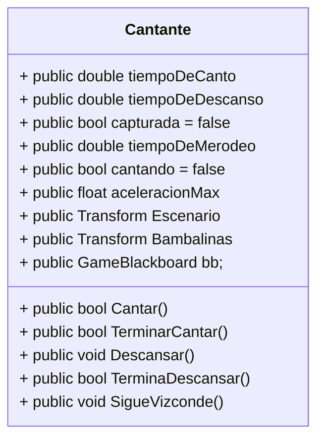
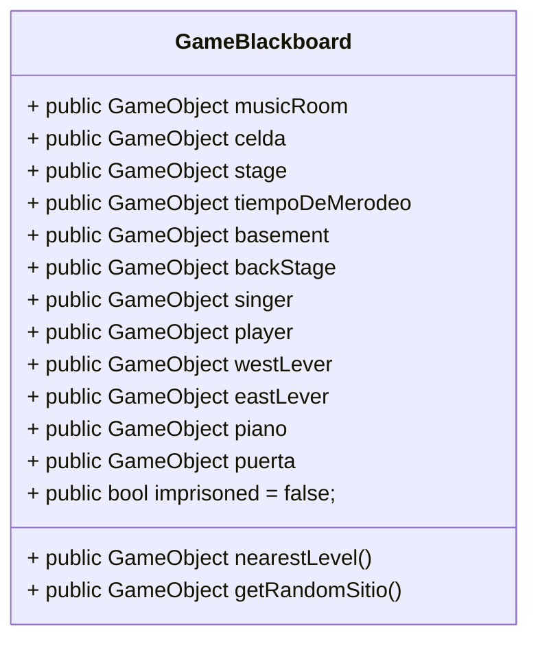
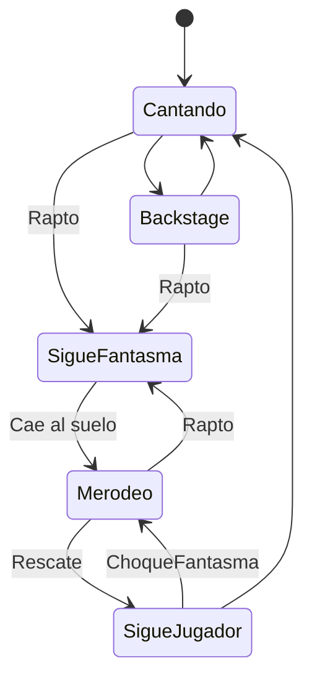
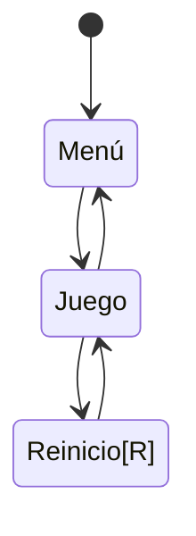

# **IAV - Decisión**

## Replica el formato de documentación habitual

## Autores
- Elisa Todd Rodríguez:  https://github.com/elisatodd
- Miguel González Pérez:  https://github.com/miggon23

## Banco de pruebas de la práctica
Pueden verse las pruebas realizadas para la práctica en el siguiente vídeo de YouTube:
https://youtu.be/pq4ZS73I9BI

## Correcciones de la documentación
Tras la primera corrección, se han añadido los siguientes apartados a la documentación:
- Pseudocódigo para el suavizado del camino.
- Arreglada la indentación en el apartado de la solución.

Tras la segunda corrección, se han hecho los siguientes cambios:
- Movidos todos los scripts modificados a la carpeta G02.

## Propuesta

La propuesta de esta práctica surge de este [enlace](https://narratech.com/es/inteligencia-artificial-para-videojuegos/decision/historias-de-fantasmas/).
La práctica consiste en desarrollar la IA del fantasma de la ópera, implementando la navegación y las decisiones del fantasma a través de los elementos del escenario, usando **árboles de comportamiento** y **máquinas de estado** 

## Punto de partida
La consideración del punto de partida es importante en esta práctica ya que la mayoría de comportamientos que necesitamos para la implementación del árbol de comportamiento y de las máquinas de estado ya vienen dados. Dentro de la carpeta **Scripts** se encuentran scripts para el control del escenario y de los **Agentes**, como el jugador. Además, hay otra subcarpeta llamada **Fantasma** con varios comportamientos del fantasma programados.

### Fantasma  

Veamos el contenido de la carpeta **Fantasma**:

- **CantanteCondition**: Clase que hereda de Conditional, que a su vez hereda de Task. Contiene un método OnUpdate() que comprueba si la cantante está cantando, y si es así, devuelve Success. Por lo visto hasta ahora Task podría ser una clase que permita conocer si una tarea va bien o mal de cara a un árbol de comportamiento.

- **CapturadaCondition**: Parecido al anterior pero falta por implementar. Condicion de si la cantante esta encarcelada.

- **GhostArreglaPianoAction**: Llama a pianoControl.ArreglaPiano() si el piano está roto. Este script tomará importancia de cara a interrumpir la acción que esté llevando el fantasma ya que deberá dejar lo que esté haciendo en ese momento. Hereda de action.

- **GhostChaseAction**: Hereda de Action. Accion de seguir a la cantante, cuando la alcanza devuelve Success. Por implementar

- **GhostCloseDoorAction**: Accion de cerrar la puerta de la celda, yendo hacia la palanca, cuando la alcanza devuelve Success. Ya viene implementado.

- **GhostLlevarCantante**: Acción de llevar a la cantante al hombro. Ya viene implementado.

- **GhostReturnAction**: Accion de ir a la sala de musica, cuando llega devuelve Success. Por implementar.

- **GhostSearchRandomAction**: Accion de ir a una sala aleatoria, asignada por el Blackboard, cuando llega devuelve Success. Implementado.

- **GhostSearchStageAction**: Accion de ir al escenario, cuando llega devuelve Success. Por implementar.

- **ImprisonedCondition**: Conditional. Devuelve Success si la cantante está en chirona. Failure en otro caso.

- **PianoCondition**: Conditional. No está implementado ni hay descripción, pero seguramente comprube el estado del piano a la hora de tener que arreglarlo.

- **PublicoCondition**: Conditional. Por implementar. El fantasma tendrá que comprobar en este script que no hay nadie en el público para poder realizar sus planes (devolviendo Task.Success).

- **VizcondeChocaCondition**: Si el fantasma choca con el Vizconde mientras lleva a la cantante, el fantasma tendrá que dejarla caer. Por implementar.

### Cantante

Aparte del fantasma, hay scripts sueltos de gran utilidad. Veamos el script **Cantante**:

Además de esos métodos, Cantante tiene métodos para seguir al fantasma, merodear y recordar estancias en las que ha estado y desde donde puede recordar como volver al Backstage.

### La pizarra
La pizarra es un elemento de información común habitualmente usado en las máquinas de estado y árboles de comportamiento para obetener información del escenario. Esta pizarra puede ser modificada por cualquier agente susceptible de modificar el escnario de juego. 

En nuestro caso, el script toma el nombre de **GameBlackboard**. Si observamos en el resto de scripts, el consultar la pizarra es un acto recurrente, pero el modificala, no se hace directamente en ella, si no guarda referencias de los objetos que podríamos necesitar. 

Como podemos ver la mayoría de datos que guarda la pizarra son los propios objetos de juego. Tambíen guarda alguna variable que no enacaja realmente con el comportamiento de ningún objeto, por lo que es interesante guardar la información aquí, como si está aprisionada la cantante.

## Diseño de la solución
Para empezar, podemos plantear las máquinas de estado y los árboles de comportamiento que siguen nuestros agentes. Empecemos viendo a la cantante y los posibles estados en los que se puede encontrar

Para la implementación del Fantasma, vamos a usar un Behaviour Tree. Para ello, podemos seguir los scripts que vienen dados para el fantasma:
Veámoslo por partes para entender mejor cada tramo de razonamiento del fantasma. ¿Qué sucede cuando quiere raptar a la cantante?

De este modo el fantasma es capaz de activar solo uno de los focos o raptar a la princesa directamente si no hay público. Además, si no está cantando, el fantasma evitará comprobar el escenario, yendo al Backstage a por la princesa. Además, hay que considerar la opción de buscar por todas las habitaciones por si estuviese por ahí perdida.

Veamos que ocurre cuando el fantasma ya ha capturado a la princesa:

La complejidad de este tramo está en decidir el camino más apropiado en función de como estaban colocadas las barcas y el Vizconde la última vez que fueron vistas por el fantasma.

Veamos que ocurre una vez el fantasma logra encerrar a la princesa y se vuelve a la habitación. Este también es el estado inicial del fantasma, ya que comenzará en la sala de música:

Este Nodo paralelo plantea una interrupción, es decir, el fantasma estará tocando hasta que escuche a la cantante de nuevo en el escenario. Sería interesante introducir las interrupciones de cara a dejar de realizar cualquier acción cuando escucha que aporrean su piano

### Ciclo de Juego

Ciclo de juego:
En el menú se podrá escoger número de minotauros y tamaño del tablero a elección del jugador.

## Pruebas y métricas

- A El jugdor se mueve con el ratón e interactúa con el click derecho
- B.1 Cada mitad del público huye cuando cae su foco
- B.2 El público vuelve tras reestablecer su foco
- C.1 La cantante cambia entre Bambalinas y escenario cada poco tiempo
- C.2 La cantante es llevada por el fantasma cuando choca con este y con el jugador si está perdida
- C.3 La cantante merodea cuando está perdida 
- D   Árbol de comportamiento complejo del Fantasma
- E   Mejora sensorial con memoria del Fantasma

### Ampliaciones
- Amp.1 

- Amp.2 

- Amp.3 

## Producción

## Referencias

Los recursos de terceros utilizados son de uso público.

- *AI for Games*, Ian Millington.
	- Chapter 4: Pathfinding
		- PathfindDijkstra (pág 209, 210, 211)
		- Implementaciones de A* pag (215 - 228)
		- Suavizado (pág 253, 254, 255, 256, 257)
- [Kaykit Medieval Builder Pack](https://kaylousberg.itch.io/kaykit-medieval-builder-pack)
- [Kaykit Dungeon](https://kaylousberg.itch.io/kaykit-dungeon)
- [Kaykit Animations](https://kaylousberg.itch.io/kaykit-animations)
- Game Maker's Toolkit: [¿Qué hace una buena IA?](https://www.youtube.com/watch?v=9bbhJi0NBkk)
