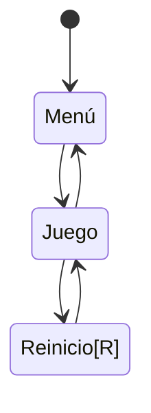

# **IAV - Decisión**

## Replica el formato de documentación habitual

## Autores
- Elisa Todd Rodríguez:  https://github.com/elisatodd
- Miguel González Pérez:  https://github.com/miggon23

## Banco de pruebas de la práctica
Pueden verse las pruebas realizadas para la práctica en el siguiente vídeo de YouTube:
https://youtu.be/pq4ZS73I9BI

## Correcciones de la documentación
Tras la primera corrección, se han añadido los siguientes apartados a la documentación:
- Pseudocódigo para el suavizado del camino.
- Arreglada la indentación en el apartado de la solución.

Tras la segunda corrección, se han hecho los siguientes cambios:
- Movidos todos los scripts modificados a la carpeta G02.

## Propuesta

La propuesta de esta práctica surge de este [enlace](https://narratech.com/es/inteligencia-artificial-para-videojuegos/decision/historias-de-fantasmas/).
La práctica consiste en desarrollar la IA del fantasma de la ópera, implementando la navegación y las decisiones del fantasma a través de los elementos del escenario, usando **árboles de comportamiento** y **máquinas de estado** 

## Punto de partida

### Agent

### Comportamientos

## Diseño de la solución

### Ciclo de Juego

Ciclo de juego:
En el menú se podrá escoger número de minotauros y tamaño del tablero a elección del jugador.

## Pruebas y métricas

- A 
- B.1 
- B.2 
- B.3 
- B.4 
- C.1 
- C.2 
- C.3 
- D   
- E.1

### Ampliaciones
- Amp.1 

- Amp.2 

- Amp.3 

## Producción

## Referencias

Los recursos de terceros utilizados son de uso público.

- *AI for Games*, Ian Millington.
	- Chapter 4: Pathfinding
		- PathfindDijkstra (pág 209, 210, 211)
		- Implementaciones de A* pag (215 - 228)
		- Suavizado (pág 253, 254, 255, 256, 257)
- [Kaykit Medieval Builder Pack](https://kaylousberg.itch.io/kaykit-medieval-builder-pack)
- [Kaykit Dungeon](https://kaylousberg.itch.io/kaykit-dungeon)
- [Kaykit Animations](https://kaylousberg.itch.io/kaykit-animations)
- Game Maker's Toolkit: [¿Qué hace una buena IA?](https://www.youtube.com/watch?v=9bbhJi0NBkk)
