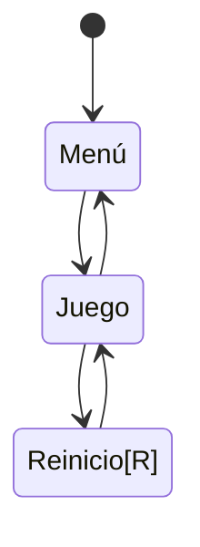

# **IAV - Decisión**

## Replica el formato de documentación habitual

## Autores
- Elisa Todd Rodríguez:  https://github.com/elisatodd
- Miguel González Pérez:  https://github.com/miggon23

## Banco de pruebas de la práctica
Pueden verse las pruebas realizadas para la práctica en el siguiente vídeo de YouTube:
https://youtu.be/pq4ZS73I9BI

## Correcciones de la documentación
Tras la primera corrección, se han añadido los siguientes apartados a la documentación:
- Pseudocódigo para el suavizado del camino.
- Arreglada la indentación en el apartado de la solución.

Tras la segunda corrección, se han hecho los siguientes cambios:
- Movidos todos los scripts modificados a la carpeta G02.

## Propuesta

La propuesta de esta práctica surge de este [enlace](https://narratech.com/es/inteligencia-artificial-para-videojuegos/decision/historias-de-fantasmas/).
La práctica consiste en desarrollar la IA del fantasma de la ópera, implementando la navegación y las decisiones del fantasma a través de los elementos del escenario, usando **árboles de comportamiento** y **máquinas de estado** 

## Punto de partida
La consideración del punto de partida es importante en esta práctica ya que la mayoría de comportamientos que necesitamos para la implementación del árbol de comportamiento y de las máquinas de estado ya vienen dados. Dentro de la carpeta **Scripts** se encuentran scripts para el control del escenario y de los **Agentes**, como el jugador. Además, hay otra subcarpeta llamada **Fantasma** con varios comportamientos del fantasma programados.

### Fantasma  

Veamos el contenido de la carpeta **Fantasma**:

- **CantanteCondition**: Clase que hereda de Conditional, que a su vez hereda de Task. Contiene un método OnUpdate() que comprueba si la cantante está cantando, y si es así, devuelve Success. Por lo visto hasta ahora Task podría ser una clase que permita conocer si una tarea va bien o mal de cara a un árbol de comportamiento.

- **CapturadaCondition**: Parecido al anterior pero falta por implementar. Condicion de si la cantante esta encarcelada.

- **GhostArreglaPianoAction**: Llama a pianoControl.ArreglaPiano() si el piano está roto. Este script tomará importancia de cara a interrumpir la acción que esté llevando el fantasma ya que deberá dejar lo que esté haciendo en ese momento. Hereda de action.

- **GhostChaseAction**: Hereda de Action. Accion de seguir a la cantante, cuando la alcanza devuelve Success. Por implementar

- **GhostCloseDoorAction**: Accion de cerrar la puerta de la celda, yendo hacia la palanca, cuando la alcanza devuelve Success. Ya viene implementado.

- **GhostLlevarCantante**: Acción de llevar a la cantante al hombro. Ya viene implementado.

- **GhostReturnAction**: Accion de ir a la sala de musica, cuando llega devuelve Success. Por implementar.

- **GhostSearchRandomAction**: Accion de ir a una sala aleatoria, asignada por el Blackboard, cuando llega devuelve Success. Implementado.

- **GhostSearchStageAction**: Accion de ir al escenario, cuando llega devuelve Success. Por implementar.

- **ImprisonedCondition**: Conditional. Devuelve Success si la cantante está en chirona. Failure en otro caso.

- **PianoCondition**: Conditional. No está implementado ni hay descripción, pero seguramente comprube el estado del piano a la hora de tener que arreglarlo.

- **PublicoCondition**: Conditional. Por implementar. El fantasma tendrá que comprobar en este script que no hay nadie en el público para poder realizar sus planes (devolviendo Task.Success).

- **VizcondeChocaCondition**: Si el fantasma choca con el Vizconde mientras lleva a la cantante, el fantasma tendrá que dejarla caer. Por implementar.

### Comportamientos

## Diseño de la solución

### Ciclo de Juego

Ciclo de juego:
En el menú se podrá escoger número de minotauros y tamaño del tablero a elección del jugador.

## Pruebas y métricas

- A El jugdor se mueve con el ratón e interactúa con el click derecho
- B.1 Cada mitad del público huye cuando cae su foco
- B.2 El público vuelve tras reestablecer su foco
- C.1 La cantante cambia entre Bambalinas y escenario cada poco tiempo
- C.2 La cantante es llevada por el fantasma cuando choca con este y con el jugador si está perdida
- C.3 La cantante merodea cuando está perdida 
- D   Árbol de comportamiento complejo del Fantasma
- E   Mejora sensorial con memoria del Fantasma

### Ampliaciones
- Amp.1 

- Amp.2 

- Amp.3 

## Producción

## Referencias

Los recursos de terceros utilizados son de uso público.

- *AI for Games*, Ian Millington.
	- Chapter 4: Pathfinding
		- PathfindDijkstra (pág 209, 210, 211)
		- Implementaciones de A* pag (215 - 228)
		- Suavizado (pág 253, 254, 255, 256, 257)
- [Kaykit Medieval Builder Pack](https://kaylousberg.itch.io/kaykit-medieval-builder-pack)
- [Kaykit Dungeon](https://kaylousberg.itch.io/kaykit-dungeon)
- [Kaykit Animations](https://kaylousberg.itch.io/kaykit-animations)
- Game Maker's Toolkit: [¿Qué hace una buena IA?](https://www.youtube.com/watch?v=9bbhJi0NBkk)
