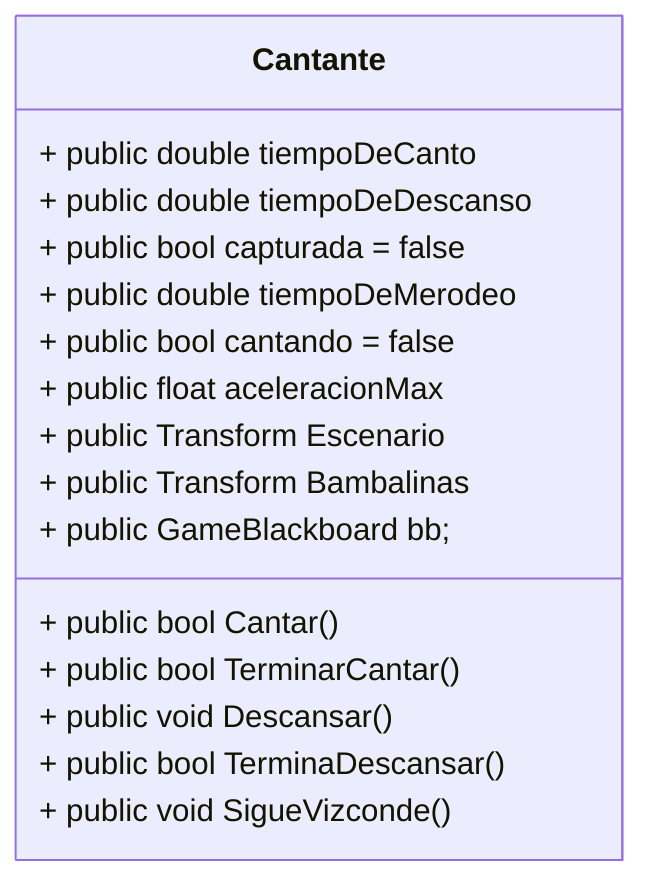
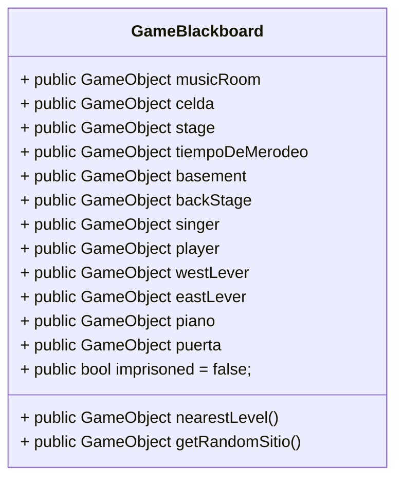
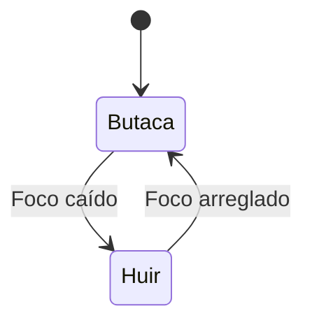
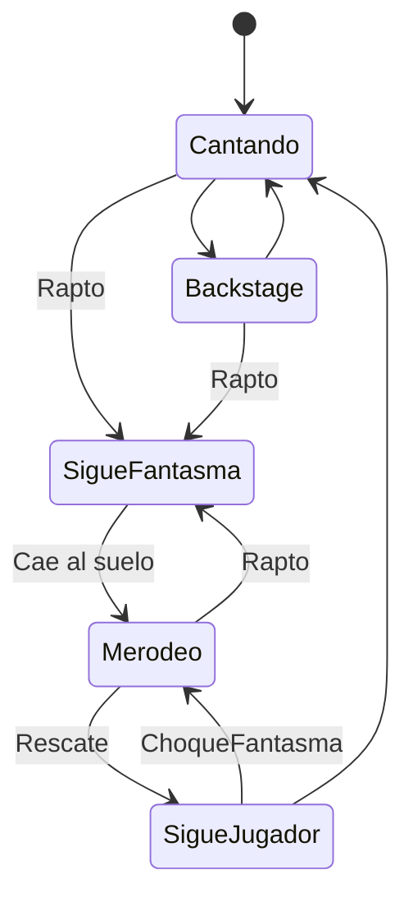

# **IAV - Decisión**

## Autores
- [Elisa Todd Rodríguez](https://github.com/elisatodd)
- [Miguel González Pérez](https://github.com/miggon23)

## Banco de pruebas de la práctica
Podrán verse las pruebas realizadas para la práctica en un vídeo de YouTube de cara a la entrega final.

## Correcciones de la documentación
Tras la primera corrección, se han añadido los siguientes apartados a la documentación:
- Añadidos los enlaces a los nombres de los alumnos.
- 

Tras la segunda corrección, se han hecho los siguientes cambios:

## Propuesta

La propuesta de esta práctica surge de este [enlace](https://narratech.com/es/inteligencia-artificial-para-videojuegos/decision/historias-de-fantasmas/).
La práctica consiste en desarrollar la IA del fantasma de la ópera, implementando la navegación y las decisiones del fantasma a través de los elementos del escenario, usando **árboles de comportamiento** y **máquinas de estado** 

El resultado final que se espera es un juego cuyo objetivo es mantener a la cantante a salvo del fantasma. Tanto el fantasma, como la cantante y el público estarán controlados por inteligencia artificial, poniéndo el foco principal en el fantasma, del cual se espera que sea un agente inteligente, reactivo al entorno y capaz de tomar decisiones interpretando lo que ve y escucha.

El fantasma tendrá como objetivo capturar a la cantante y llevarla a su prisión, para después ponerse a tocar el piano. Sin embargo, no puede realizar el secuestro si hay público presenciando la actuación de la cantante, por lo que deberá derribar los focos del escenario, sembrando el pánico y causando que el público huya. Una vez no haya testigos, podrá capturar a la cantante y llevarla a su prisión. Para capturarla, primero debe buscarla. Comienza buscándola en el escenario, y si no estuviera ahí, comprueba el backstage. Si siguiera sin encontrarla, la busca por las diferentes habitaciones hasta dar con ella, o escucharla cantar de nuevo, entonces sabrá que está en el escenario.

En cuanto a la cantante, se dedica a cantar en el escenario, descansando en el backstage de vez en cuando. Si el fantasma la alcanza, la secuestra y la comienza a guiar hasta la cárcel.

Como jugador, tienes varios recursos para pararle los pies al fantasma. En primer lugar, puedes arreglar los focos que previamente ha roto, permitiéndo al público volver a observar la actuación. También puedes tirarlos, pero sería contraproducente para tu objetivo.
Además, puedes ir hasta el piano del fantasma y aporrearlo, causando que éste deje todo lo que está haciendo y vaya hacia él para arreglarlo. Finalmente, si interceptas al fantasma mientras tiene secuestrada a la cantante (o si aporreas su piano), la suelta, y ahora la cantante pasará a estar perdida en un estado de merodeo entre las habitaciones. Se quedará así hasta que encuentre de nuevo el escenario.

Si encuentras a la cantante mientras está perdida, ésta comenzará a seguirte, y deberás guiarla hasta el escenario. Una vez ha llegado al escenario, conocerá la ruta que le has enseñado, por lo que, si vuelve a perderse en algún punto de ésta, sabrá volver sola.

También hay en el escenario unas barcas que permiten desplazarse entre habitaciones.

También queremos dotar al fantasma de memoria, recordando las posiciones del jugador, la cantante y las barcas, reaccionando en consecuencia y dando mayor sensación de inteligencia al jugador.

## Punto de partida
La consideración del punto de partida es importante en esta práctica ya que la mayoría de comportamientos que necesitamos para la implementación del árbol de comportamiento y de las máquinas de estado ya vienen dados. Dentro de la carpeta **Scripts** se encuentran scripts para el control del escenario y de los **Agentes**, como el jugador. Además, hay otra subcarpeta llamada **Fantasma** con varios comportamientos del fantasma programados.

### Fantasma  

Veamos el contenido de la carpeta **Fantasma**:

- **CantanteCondition**: Clase que hereda de Conditional, que a su vez hereda de Task. Contiene un método OnUpdate() que comprueba si la cantante está cantando, y si es así, devuelve Success. Por lo visto hasta ahora Task podría ser una clase que permita conocer si una tarea va bien o mal de cara a un árbol de comportamiento.

- **CapturadaCondition**: Parecido al anterior pero falta por implementar. En este caso devolverá si la cantante se encuentra capturada o no. Con capturada se quiere decir cuando está siendo retenida por el fantasma, no cuando está encarcelada.

- **GhostArreglaPianoAction**: Llama a pianoControl.ArreglaPiano() si el piano está roto. Este script tomará importancia de cara a interrumpir la acción que esté llevando el fantasma ya que deberá dejar lo que esté haciendo en ese momento. Hereda de action.

- **GhostChaseAction**: Hereda de Action. Accion de seguir a la cantante, cuando la alcanza devuelve Success. Por implementar.

- **GhostCloseDoorAction**: Accion de cerrar la puerta de la celda, yendo hacia la palanca, cuando la alcanza devuelve Success. Ya viene implementado.

- **GhostLlevarCantante**: Acción de llevar a la cantante al hombro. Ya viene implementado.

- **GhostReturnAction**: Accion de ir a la sala de musica, cuando llega devuelve Success. Por implementar.

- **GhostSearchRandomAction**: Accion de ir a una sala aleatoria, asignada por el Blackboard, cuando llega devuelve Success. Implementado.

- **GhostSearchStageAction**: Accion de ir al escenario, cuando llega devuelve Success. Por implementar.

- **ImprisonedCondition**: Conditional. Devuelve Success si la cantante está encarcelada. Failure en otro caso.

- **PianoCondition**: Conditional. No está implementado ni hay descripción, pero comprobará el estado del piano a la hora de tener que arreglarlo, es decir, si está roto o no.

- **PublicoCondition**: Conditional. Por implementar. El fantasma tendrá que comprobar en este script que no hay nadie en el público para poder realizar sus planes (devolviendo Task.Success).

- **VizcondeChocaCondition**: Si el fantasma choca con el Vizconde mientras lleva a la cantante, el fantasma tendrá que dejarla caer. Por implementar.

### Cantante

Aparte del fantasma, hay scripts sueltos de gran utilidad. Veamos el script **Cantante**:

Además de esos métodos, Cantante tiene métodos para seguir al fantasma, merodear y recordar estancias en las que ha estado y desde donde puede recordar como volver al Backstage.

### La pizarra
La pizarra es un elemento de información común habitualmente usado en las máquinas de estado y árboles de comportamiento para obtener información del escenario. Esta pizarra puede ser modificada por cualquier agente susceptible de modificar el escnario de juego. 

En nuestro caso, el script toma el nombre de **GameBlackboard**. Si observamos en el resto de scripts, el consultar la pizarra es un acto recurrente, pero el modificarla, no se hace directamente en ella, si no guardando referencias de los objetos que podríamos necesitar. 

Como podemos ver la mayoría de datos que guarda la pizarra son los propios objetos de juego. Tambíen guarda alguna variable que no enacaja realmente con el comportamiento de ningún objeto, por lo que es interesante guardar cierta información aquí, como si está aprisionada o no la cantante.

## Diseño de la solución
Para empezar, podemos plantear las máquinas de estado y los árboles de comportamiento que siguen nuestros agentes. 

El comportamiento del público es el más sencillo, tiene dos estados, el de estar en la butaca y el de estar en la sala cuando se tira el foco de su lado.

En cuanto a la cantante, estos serán los posibles estados en los que se puede encontrar:

La mayoría de cambios de estado de la cantante vienen dados por agentes externos, ya sea el fantasma o el Vizconde.

Para la implementación del Fantasma, vamos a usar un Behaviour Tree. Para ello, podemos seguir los scripts que vienen dados para el fantasma:
Veámoslo por partes para entender mejor cada tramo de razonamiento del fantasma. ¿Qué sucede cuando quiere raptar a la cantante?

De este modo el fantasma es capaz de activar solo uno de los focos o raptar a la cantante directamente si no hay público. Además, si no está cantando, el fantasma evitará comprobar el escenario, yendo al Backstage a por la cantante. Hay que considerar también la opción de buscar por todas las habitaciones por si estuviese por ahí perdida.

Veamos que ocurre cuando el fantasma ya ha capturado a la cantante:

La complejidad de este tramo está en decidir el camino más apropiado en función de como estaban colocadas las barcas y el Vizconde la última vez que fueron vistos por el fantasma.

Veamos que ocurre una vez el fantasma logra encerrar a la cantante y se vuelve a la habitación. Este también es el estado inicial del fantasma, ya que comenzará en la sala de música:

Este Nodo paralelo plantea una interrupción, es decir, el fantasma estará tocando hasta que escuche a la cantante de nuevo en el escenario. Sería interesante introducir las interrupciones de cara a dejar de realizar cualquier acción cuando escucha que aporrean su piano. Para esto vamos a introducir los conditional aborts y vamos a ver como quedaría todo el BT del fantasma una vez combinado todo. Para ello vamos a meter arreglar el piano como tarea de gran prioridad, pudiendo interrumpir cualquier acción concurrente del fantasma:

Hemos refactorizado la parte de buscar a la cantante para capturarla. Ahora, si intenta capturar a la cantante y no lo consigue porque no se encuentra ni en el escenario ni en el Backstage, la buscará por todas las habitaciones hasta que la encuentre o la escuche cantar desde el escenario. También sale a por la cantante si la oye cantar o si (en su mente) sabe que no está encerrada (ya sea porque la llevaba consigo y se ha perdido o por acciones del Vizconde).

También se ha añadido a la búsqueda de la cantante por parte del fantasma, un nodo secuencia que intenta buscar a la cantante por donde se encontraba si es que fue vista por él hace menos de 15 segundos. Esto nos permitirá que el fantasma busque a la cantante en la zona donde se perdiere cuando choque contra el jugador, en lugar de ir directamente al escenario a buscarla. En caso de no conseguirlo, el nodo selector al que está unido esta secuencia, tratará de llevar a cabo la búsqueda habitual de la cantante. Toda esta rama está conectada a un ConditionalAbort de tipo Lower Priority que interrumpirá a los hermanos de la izquierda en cuanto la cantante se ponga a cantar o deje de estar secuestrada (a conocimiento del fantasma), por ejemplo, cuando el Vizconde choca contra él.

Al introducir los ConditionalAborts ya no es necesario tener un nodo de paralelismo (el de la triple flecha) ya que se abortará la acción de tocar el piano en cuanto empiece a cantar la cantante, por lo que moverse a la sala de música y empezar a tocar el piano lo hemos dejado como tarea menos prioritaria.

También nos hemos aprovechado de los conditional aborts para que, en cuanto tenga a la cantante consigo, la lleve a la prisión, ya que estábamos teniendo problemas a la hora de plantear dónde había que situar esta acción. De este modo, cuando el fantasma se haga con la cantate, se abortará la tarea que esté haciendo en ese momento para llevarla a la prisión.

## Pruebas y métricas

- A   El jugador se mueve con el ratón e interactúa con el click derecho
- B.1 Cada mitad del público huye cuando cae su foco
- B.2 El público vuelve tras reestablecer su foco
- C.1 La cantante cambia entre Bambalinas y escenario cada poco tiempo
- C.2 La cantante es llevada por el fantasma cuando chocan
- C.3 La cantante es llevada por el jugador si está perdida y chocan
- C.4 La cantante merodea cuando está perdida
- D   Árbol de comportamiento complejo del Fantasma (ver desglosado en la sección 'Producción')
- E   Mejora sensorial con memoria del Fantasma

### Ampliaciones
- Amp.1 : La cantante recuerda cómo volver desde cierto punto hasta el escenario.

- Amp.2 : Cuando la cantante está siendo rescatada, y llega a un punto del mapa desde el que recuerde cómo llegar al escenario, deja de seguir al jugador y vuelve sola.

- Amp.3 : El fantasma tiene memoria de dónde vio a la cantante por última vez durante unos segundos.

## Producción
La producción y la distribución de tareas se realiza sobre este esquema:

| Estado  |  Tarea  |  Estudiante  |  Progreso  |
|:-:|:--|:-:|:-:|
| ✔ | Redactar documentación | Elisa y Miguel | 90% |
| ✔ | Crear diagramas de estado y BT | Miguel | 100% |
|  | Redactar alcance de la práctica | Elisa | 0% |
| ✔ | A: Interacción del jugador con click derecho | Miguel | 100% |
| ✔ | B: Cada mitad del público huye cuando cae su foco | Elisa | 100% |
| ✔ | B: El público vuelve tras reestablecer su foco | Miguel | 100% |
| ✔ | C: La cantante cambia entre Bambalinas y escenario cada poco tiempo | Miguel | 100% |
|  | C: La cantante es llevada por el fantasma cuando chocan |  | 0% |
|  | C: La cantante es llevada por el jugador si está perdida y chocan |  | 0% |
| ✔ | C: La cantante merodea cuando está perdida  | Miguel | 100% |
|  | C: La cantante vuelve al estado inicial cuando el jugador la salva y la lleva al escenario  |  | 0% |
| ✔ | D: El fantasma tira los focos cuando hay público  | Ambos | 100% |
|  | D: El fantasma busca a la cantante en las diferentes ubicaciones con prioridad  |  | 0% |
|  | D: El fantasma captura a la cantante cuando chocan |  | 0% |
|  | D: El fantasma lleva a la cantante hasta la prisión |  | 0% |
|  | D: El fantasma lleva a la cantante hasta la prisión con el camino más corto |  | 0% |
|  | D: El fantasma toca el piano cuando aprisiona a la cantante |  | 0% |
|  | D: El fantasma escucha a la cantante y vuelve a buscarla |  | 0% |
|  | D: El fantasma deja lo que está haciendo cuando oye su piano para arreglarlo |  | 0% |
|  | E: El fantasma recuerda si vió a la cantante en los últimos X segundos |  | 0% |
|  | E: El fantasma analiza qué mitad del público falta para evitar acciones innecesarias |  | 0% |

## Referencias

Los recursos de terceros utilizados son de uso público.

- *AI for Games*, Ian Millington.
- Game Maker's Toolkit: [¿Qué hace una buena IA?](https://www.youtube.com/watch?v=9bbhJi0NBkk)
- Uso de [esta plataforma](https://app.diagrams.net/) para la realización de esquemas.
